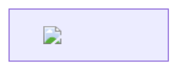

# markdown-samples

Picture 1:

Picture 2:

Diagram 1:

```mermaid
graph
  kubernetes["<img src='https://raw.githubusercontent.com/cncf/artwork/master/projects/kubernetes/icon/color/kubernetes-icon-color.svg' />"]
```

Diagram 2:

```mermaid
graph
  kubernetes["<img src='kubernetes-icon-color.svg' />"]
```
